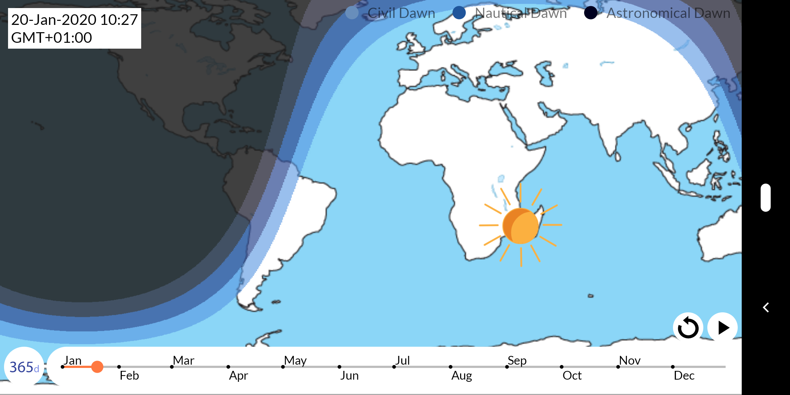
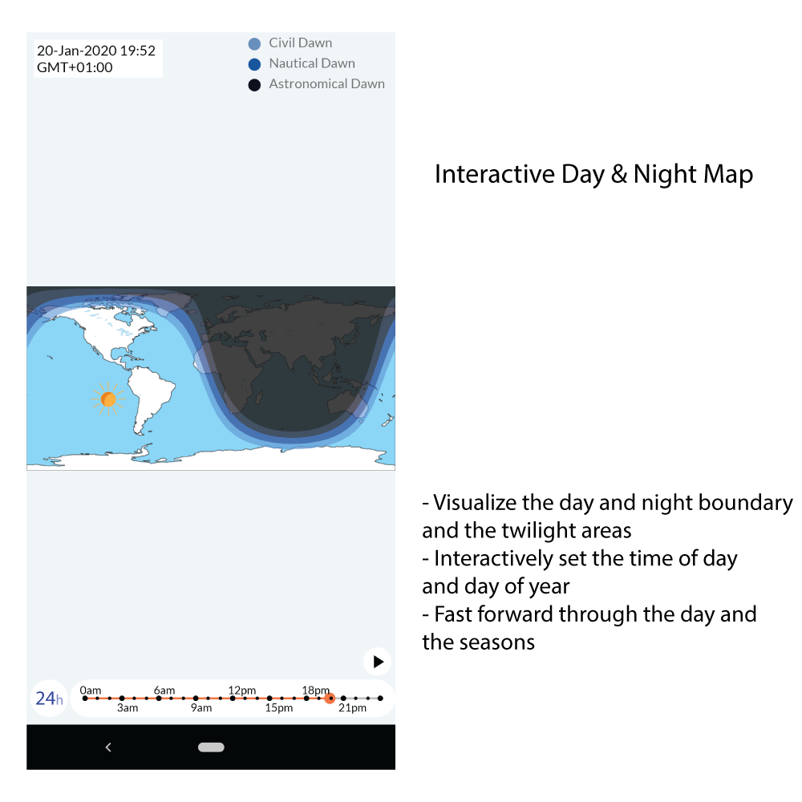
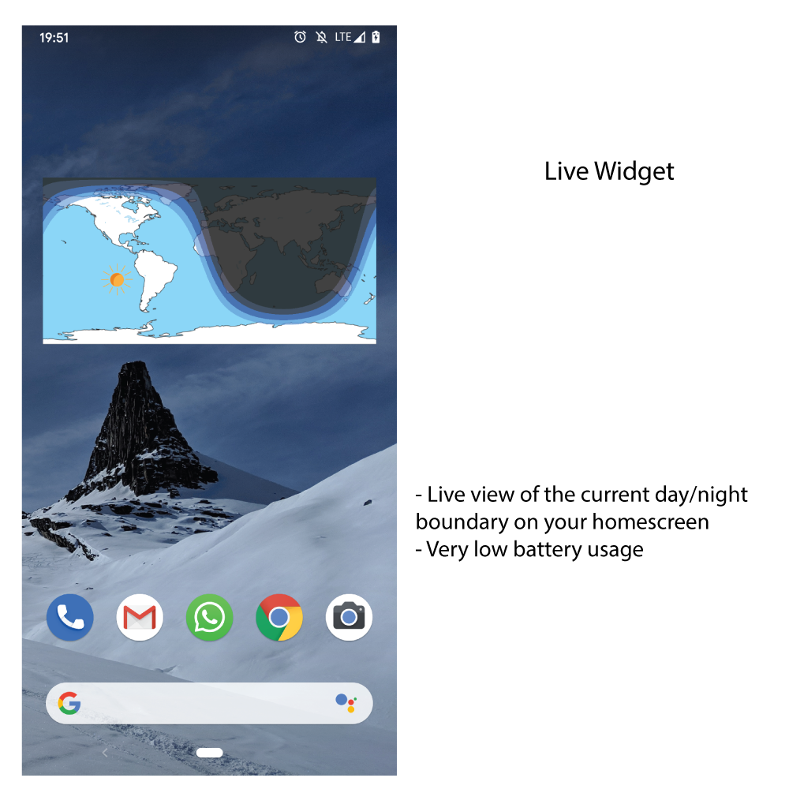

# Day & Night Map Android App

The World map shows what areas of the Earth are in daylight, which are at night and in twilight.
Use the slider to interactively set the time and date and visualize the changing of the seasons and the length of the day.
The widget shows live data on your homescreen and is designed to be very battery friendly.

This is an open source port of [*Day & Night Map and Widget* available on Google Play](https://play.google.com/store/apps/details?id=com.genewarrior.daynightmap).

*Day & Night Map and Widget* is itself based on [SunLocator](http://sunlocator.com), an app
to predict the sun's position in multiple ways (Augmented Reality, Map, 3D Terrain simulation).
[Available on Google Play](https://play.google.com/store/apps/details?id=com.genewarrior.sunlocator.pro).

## Key Elements

### Renderscript

The Renderscript file [daynightscript.rs](app/src/main/rs/daynightscript.rs)
handles the rendering of the map's shadows on a pixel by pixel basis, depicting regions with night,
civil dawn/dusk, nautical dawn/dusk and astronomical dawn/dusk. Mercator projection of the map makes it
straightforward to calculate which pixel is which longitude/latitude.

Calculation is based on [Grena, 2012 - Five new algorithms for the computation of sun position from 2010 to 2110](https://www.sciencedirect.com/science/article/abs/pii/S0038092X12000400)
algorithms with modifications.

[Renderscript](https://developer.android.com/guide/topics/renderscript/compute)
allows running computational intensive tasks in parallel using GPUs and multi-core CPUs.
This lets the app calculate the sun elevation at every pixel of the map (800x400 px) very fast while
allowing interactively changing the time/date.

**Note:** RenderScript is deprecated starting in Android 12. [See here.](https://developer.android.com/guide/topics/renderscript/migrate)
I still have not got around to migrate it to Vulkan, as suggested in the linked article.

### Android Layouts

The app itself is quite straightforward. [PhotoView](https://github.com/Baseflow/PhotoView) is
used to allow a tiny bit of panning/zooming the map.
The widget is implemented in [DayNightWidget.java](app/src/main/java/com/genewarrior/daynightmap/Widget/DayNightWidget.java).

